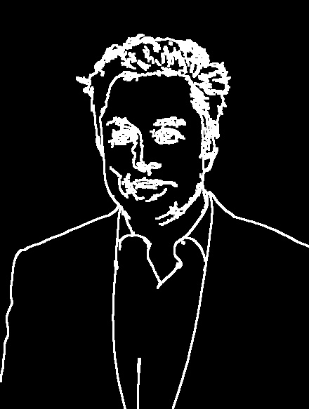

# Cartoonizer using OpenCV
This is a Python script that uses the OpenCV library to cartoonize an image. The script applies a color quantization filter to the image to reduce the number of colors, then applies a bilateral filter and a median blur to create a simplified version of the image. The Canny edge detection algorithm is then used to detect the edges in the image, which are dilated to create thicker lines. The result is a cartoonized version of the original image with simplified colors and thicker lines.

Installation
To use this script, you need to have Python 3 and OpenCV installed on your system. You can install OpenCV using pip:

```
pip install opencv-python
```

Usage
To use the script, run the following command in a terminal:

```
python cartoonize.py --image <image_path>
```

Replace input_image.jpg with the path to your input image file. The output will be saved as cartoonized.jpg in the same directory as the input image.

Examples
Here are some examples of images that were cartoonized using this script:

<p>cartoon_original</p>


<p>cartoon_fixed</p>


<p>cartoon_canny_like_v1</p>


<p>cartoon_canny_like_v2</p>


